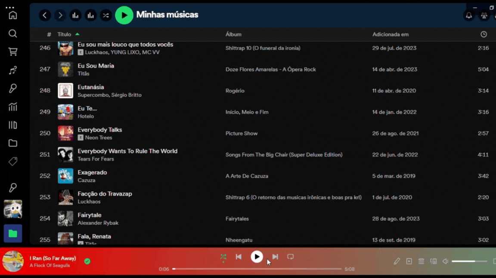

# Playbar-dinamico

Uma extensão [Spicetify](https://github.com/spicetify/spicetify-cli) que permite personalizar o play-bar em um gradient da musica atual com a passada ( ou com a musica atual em outras tonalidades) 

# Playbar-dynamic

An extension for the [Spicetify](https://github.com/spicetify/spicetify-cli) that allows you to customize the play-bar in a gradient of the current song with the past(or current song but with different color shades)

###### don't know English

## Preview

 

## Made with Spicetify Creator

- https://github.com/spicetify/spicetify-creator
